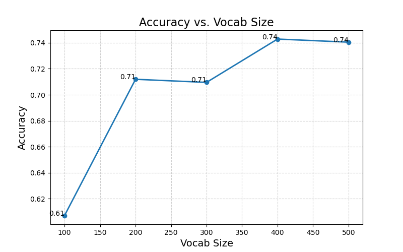

# Scene-recognition-with-bag-of-words

<center>
<p style="color: #666;">
An example of a typical bag of words classification pipeline. Figure by <a href="http://www.robots.ox.ac.uk/~vgg/research/encoding_eval/">Chatfield et al.</a></p><p></p></center>

## Overview
The goal of this project is to solve classical computer vision topic, image classification. In particular, I examine the task of classification on UCMerced Land Use dataset with simplest method, bags of quantized local features and linear classifiers learned by SVC(support vector classifier).

## Implementation
### 1. Vocabulary of Visual Words
Before we can represent our training and testing images as bag of feature histograms, we first need to establish a vocabulary of visual words. To create a vocabulary, we are going to sample several local feature based on SIFT descriptors, and then clustering them with kmeans. ```dsift(fast=True)``` is a efficient method to get SIFT descriptors, while ```kmeans()``` can return the cluster centroids. The number of clusters plays an important role, the larger the size, the better the performance. I set ```step_size=[5, 5]``` in order to accelerate the code.

NOTE: In this section, we have to run ```build_vocabulary.py```, which will take some time to construct the vocabulary.

```python3
bag_of_features = []

for path in image_paths:
img = np.asarray(Image.open(path).convert('L'),dtype='float32')
frames, descriptors = dsift(img, step=[5,5], fast=True)
bag_of_features.append(descriptors)
bag_of_features = np.concatenate(bag_of_features, axis=0).astype('float32')

vocab = kmeans(bag_of_features, vocab_size, initialization="PLUSPLUS")        
```

### 2. Bag of SIFT
Now we are ready to represent our training and testing images as histograms of visual words. Theoretically, we will get a plenty of SIFT descriptors with ```dsift()``` function. Instead of storing hundreds of SIFT descriptors, we simply count how many SIFT descriptors fall into each cluster in our visual word vocabulary. We use euclidean distance to measure which cluster the descriptor belongs, creating corresponding histograms of visual words of each image. I have noticed that parameter  ```step``` varied accuracy quite a lot. I have tried with step=[5,5], step=[2,2] and step=[1,1]. Based on the experiment, the smaller the step, the higher the accuracy. It might because smaller step size can captere more details, contributing to more precise prediction. To avoid the wrong prediction due to various image size, I also normalized the histogram here.

```python
with open(f'vocab_{vocab_size}.pkl', 'rb') as handle:
        vocab = pickle.load(handle)
    
    image_feats = []
    
    start_time = time()
    print("Construct bags of sifts...")
    
    for path in image_paths:
        img = np.asarray(Image.open(path).convert('L'),dtype='float32')
        frames, descriptors = dsift(img, step=[1,1], fast=True)
        dist = distance.cdist(vocab, descriptors, metric='euclidean')
        idx = np.argmin(dist, axis=0)
        hist, bin_edges = np.histogram(idx, bins=len(vocab))
        hist_norm = [float(i)/sum(hist) for i in hist]
        
        image_feats.append(hist_norm)
        
    image_feats = np.asarray(image_feats)
```

### 3. SVMs(Support Vector Machines)
The last task is to train 1-vs-all linear SVMS to operate in the bag of SIFT feature space. Linear classifiers are one of the simplest possible learning models. The feature space is partitioned by a learned hyperplane and test cases are categorized based on which side of that hyperplane they fall on. ```LinearSVC()``` of scikit-learn provides a convenient way to implement SVMs. In addition, the parameter ```multi-class='ovr'``` realizes multi-class prediction. Hyperparameter tuning is extremely significant in this part, especially ```C```. I have used the preset value of 700 as previous author tried with various value, from 1.0 to 5000.0, and reported that the highest accuracy showed up on C=700.

```python
SVC = LinearSVC(C=700.0, class_weight=None, dual=True, fit_intercept=True,
intercept_scaling=1, loss='squared_hinge', max_iter= 2000,
multi_class='ovr', penalty='l2', random_state=0, tol= 1e-4,
verbose=0)

SVC.fit(train_image_feats, train_labels)
pred_label = SVC.predict(test_image_feats)
```

## Installation
1. Install [cyvlfeat](https://github.com/menpo/cyvlfeat) by running `conda install -c menpo cyvlfeat`
2. Run ```proj3.py```

Note: To tune the hyperparameter, please modify them directly in corresponding ```.py``` file, such as C(penalty) in ```svm_classify```.

## Best Accuracy
```
Accuracy for vocab size 400=  0.7428571428571429
agricultural: 0.35
airplane: 0.5
baseballdiamond: 0.6
beach: 0.8
buildings: 0.8
chaparral: 1.0
denseresidential: 0.55
forest: 0.95
freeway: 0.85
golfcourse: 0.85
harbor: 1.0
intersection: 0.7
mediumresidential: 0.7
mobilehomepark: 0.9
overpass: 0.8
parkinglot: 0.95
river: 0.35
runway: 0.9
sparseresidential: 0.65
storagetanks: 0.6
tenniscourt: 0.8
```

## Results
Accuracy using Bag of sift features with linear SVM classifier reaches up to 0.742.

<table border=0 cellpadding=4 cellspacing=1>
<tr>
<th colspan=2>Confusion Matrix</th>
</tr>
<tr>
<td>Bag of SIFT ft. Linear SVM</td>
<td> 0.7428571428571429</td>
<td bgcolor=LightBlue></td>
</tr>
</table>

## Visualization
Plot showing change in accuracy with number of codewords in clustering (vocabulary size):
<p style="color: #666;">

A t-SNE visualization of the keypoints (each of 128 dimensions in SIFT) of the vocabulary:
<p style="color: #666;">

## Credits
This project is modified by Sai Vivek Mulukuri based on Chia-Hung Yuan which in turn is based on Min Sun, James Hays and Derek Hoiem's previous developed projects 
